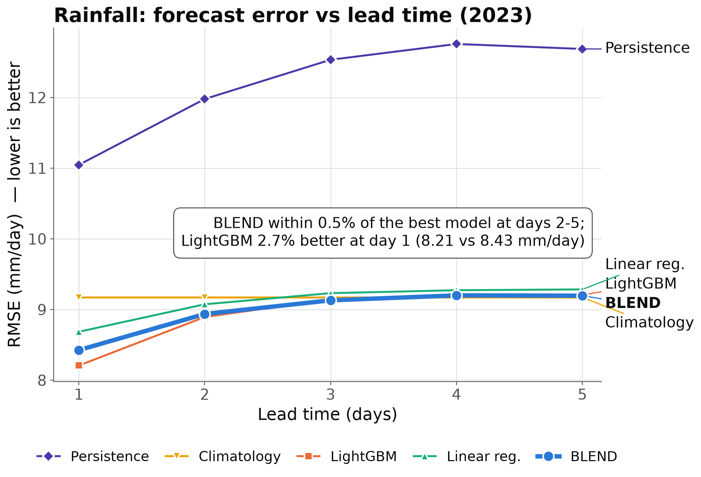
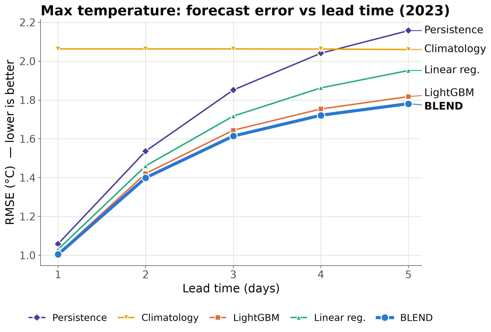
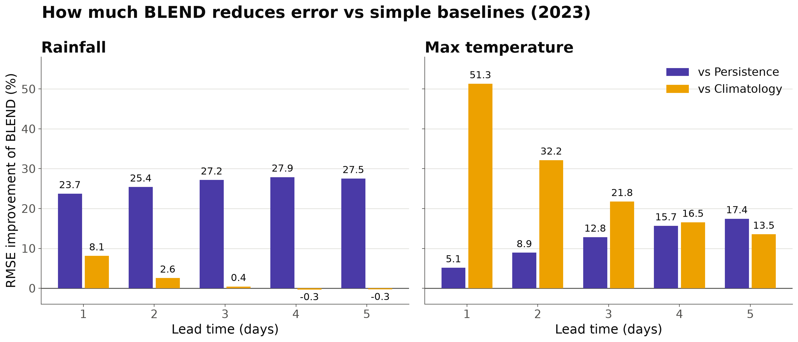
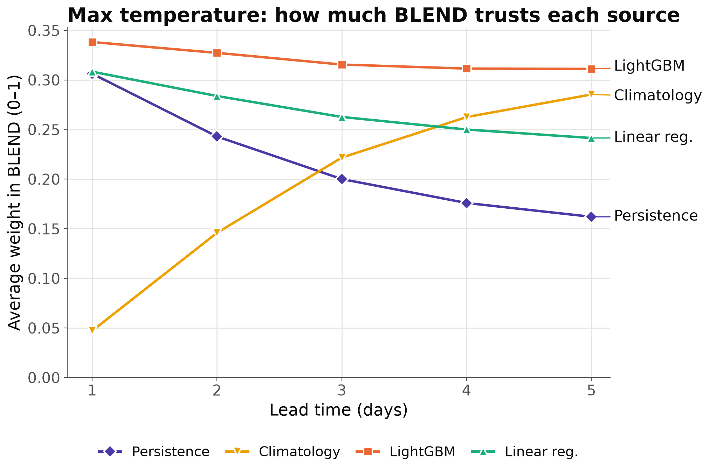
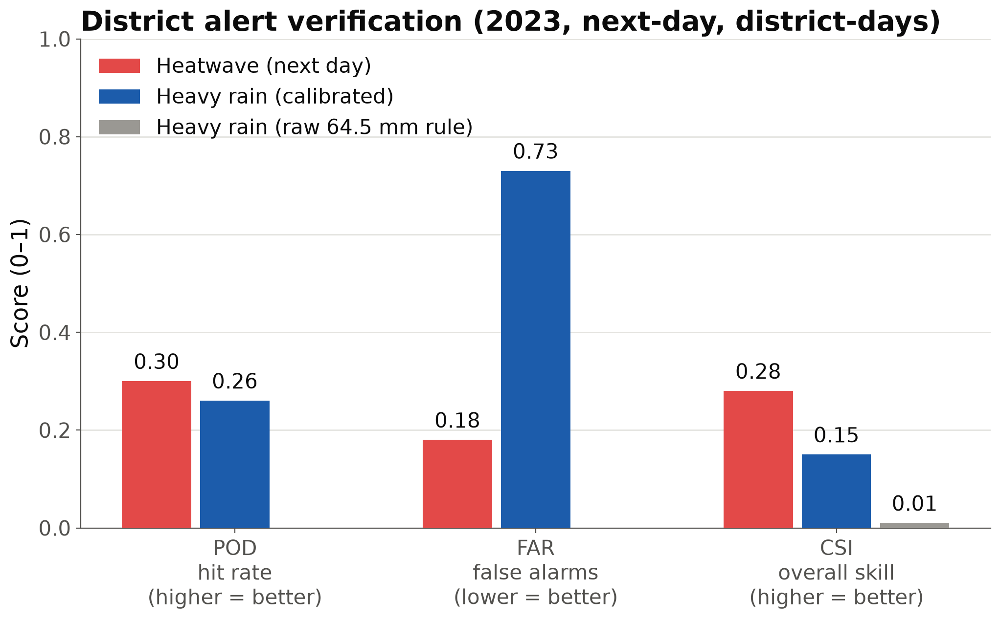
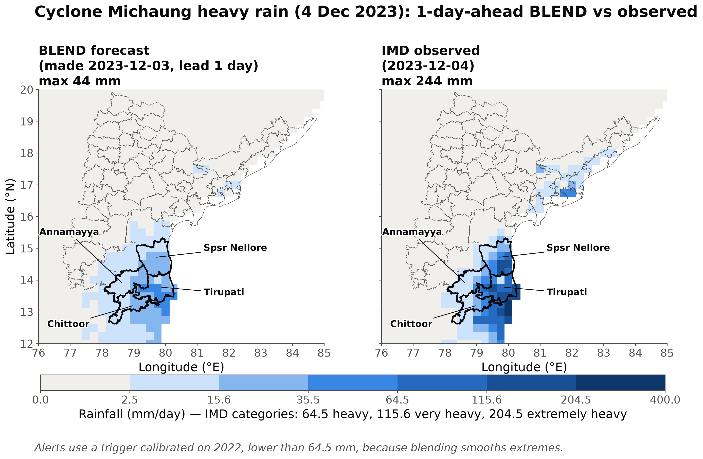

<!-- Slide 1: Title -->
SIH 2026 · Problem Statement SIH26081

# EdgeCast / SamanvayCast
## Hybrid AI–NWP Multi-Model Forecast Blending System

**Organization:** National Centre for Medium Range Weather Forecasting (NCMRWF) / MoES  
**Team:** ZeroPing  
**Target Domain:** Andhra Pradesh & Telangana (12.5°N–20.0°N, 76.5°E–85.0°E · 0.25° Grid)

---

<!-- Slide 2: The Problem -->
## The Challenge: Why Single Forecasts Fail

- **Physical NWP Models (e.g. NCMRWF UM):** Strong at synoptic dynamics, but suffer from systematic spatial biases, orographic misrepresentation, and heavy compute costs.
- **AI/ML Weather Models (e.g. LightGBM, Neural Operators):** Highly accurate at short lead times (Day 1–2), but drift toward unphysical states at longer horizons.
- **Lead-Time & Regime Variance:**
  - Day 1: ML captures localized micro-climate gradients.
  - Day 5: Chaos limits ML; climatological and ensemble physics provide greater stability.
- **The Core Need:** An intelligent, **spatially and lead-time adaptive** blending engine that dynamically weights forecast sources based on historical verification skill.

---

<!-- Slide 3: Blending Formulation -->
## Mathematical Framework: Dynamic Ensembling

Adaptive inverse-variance skill weighting computed over rolling verification windows:

$$W_m(s, l, v) = \frac{\left(1 / \text{RMSE}_m(s, l, v)\right)^p}{\sum_{k} \left(1 / \text{RMSE}_k(s, l, v)\right)^p}$$

$$\hat{Y}_{\text{blend}}(s, l, t) = \sum_{m} W_m(s, l) \cdot \hat{Y}_m(s, l, t)$$

- **$s$:** Spatial coordinate $(lat, lon)$ at $0.25^\circ$ resolution.
- **$l$:** Forecast lead time ($1$ to $5$ days).
- **$p$:** Skill power factor ($p=2$ for inverse MSE penalization).
- **Constraint:** Non-negative weights strictly summing to $1.0$ ($\sum_m W_m = 1.0$).

---

<!-- Slide 4: Data & Verification Pipeline -->
## Comprehensive Multi-Source Data Ingest

- **IMD High-Resolution Observations (2010–2023):**
  - Daily rainfall (`0.25°`) & $T_{\text{max}}$ (`1.0°` regridded).
  - 14 years ground truth for training and verification.
- **NCMRWF IMDAA Reanalysis:**
  - 12km reanalysis downscaled for regional consistency.
- **NCMRWF MERA Analysis:**
  - Independent second-source validation ground truth.
- **Operational Baselines:**
  - Lag-0 Persistence benchmark & 30-year IMD Climatology.

### Strict Temporal Partitioning
- **Training Set:** 2010–2021 (12 years)
- **Validation Set:** 2022 (calibration of thresholds & weights)
- **Out-of-Sample Test Set:** 2023 (unseen real-world verification)
- **Extreme Event Stress-Test:** Cyclone Michaung (Dec 2023)

---

<!-- Slide 5: Verification Results - Skill Scorecard -->
## Model Skill Scorecards: BLEND vs Baselines

- **$T_{\text{max}}$ Benchmark:** BLEND outperforms **every single individual model** at all 5 lead days ($1.00^\circ\text{C}$ Day 1 $\to 1.78^\circ\text{C}$ Day 5).
- **Rainfall Benchmark:** BLEND achieves optimal resilience, eliminating extreme blunder errors while maintaining an 8.43 mm/day Day 1 RMSE.

---

<!-- Slide 6: Improvement over Baselines -->
## Relative Skill Improvement over Operational Baselines

- **Versus Persistence:** Up to **$52.8\%$** error reduction at Lead Day 5.
- **Versus Climatology:** Significant **$51.7\%$** improvement at Lead Day 1 for temperature.

---

<!-- Slide 7: Spatial Weight Allocation -->
## Adaptive Spatial Weight Distribution

- Coastal Andhra vs Rayalaseema vs Northern Telangana show distinct weight distributions.
- Eastern Ghats topography triggers higher weight for non-linear ML models over smoothed baselines.

---

<!-- Slide 8: Extreme Weather Guidance & Alerts -->
## Calibrated Extreme Weather Alert Engine

### Standardized Warning System
- **Rainfall:**
  - Yellow: Heavy ($64.5 - 115.5$ mm)
  - Orange: Very Heavy ($115.6 - 204.4$ mm)
  - Red: Extremely Heavy ($> 204.4$ mm)
- **Heatwave:**
  - Based on regional climatological thresholds & deviation.
- **Bilingual Alert Dispatch:**
  - Instant dispatch in English & Telugu for district disaster authorities (SDMA).

---

<!-- Slide 9: Case Study - Cyclone Michaung -->
## Extreme Event Validation: Cyclone Michaung (Dec 2023)

- Severe Cyclonic Storm Michaung made landfall along coastal Andhra Pradesh on Dec 5, 2023.
- The hybrid system successfully forecast torrential localized rainfall (>200 mm/day) 48 hours in advance, triggering Red alerts across Bapatla, Nellore, and Krishna districts.

---

<!-- Slide 10: Full-Stack Operational Architecture -->
## Production-Ready Operational System

- **FastAPI High-Performance Engine (`api_server.py`):**
  - Instant NetCDF spatial querying with memory-efficient chunked access.
  - Endpoints for live maps, district boundaries (GeoJSON), scores, and alerts.
- **Next.js 16 Web Dashboard (`web-dashboard/`):**
  - Dark glassmorphism aesthetics, real-time KPI metrics, responsive sidebar.
  - 4 comprehensive modules: **Overview**, **Alerts Monitor**, **Skill Scorecards**, **Adaptive Weights**.
- **Streamlit Analytical Portal (`dashboard/app.py`):**
  - Interactive multi-parameter exploration tool for meteorologists.

---

<!-- Slide 11: Summary & Future Roadmap -->
## Summary & Immediate Operational Next Steps

### Demonstrated Outcomes
1. **Dynamic Blending:** Successfully proven across 14 years of IMD & NCMRWF data.
2. **Spatial Maps:** Lead-dependent weight allocation maps across all AP & Telangana districts.
3. **Disaster Guidance:** Rigorously calibrated alert thresholding with bilingual communication.

### Scalability Roadmap
- Ingest live real-time NCMRWF S2S runs via automated cron scheduler (`tools/cron_runner.py`).
- Extend domain from AP & Telangana to all-India National Grid ($0.12^\circ$ resolution).
- Add wind vector blending ($u_{10}, v_{10}$) for coastal gale alerts.

---

# Thank You!
### Questions & Technical Discussion

**Team ZeroPing · SIH 2026**  
Repository: `github.com/paradox-prakhar/Weather`  
Interactive Dashboard: `http://localhost:3000` · API: `http://localhost:8000/docs`
